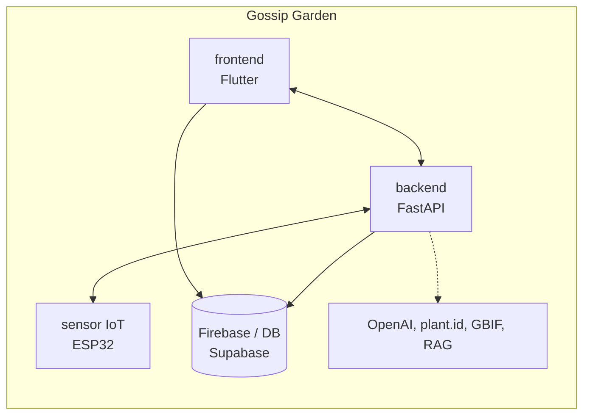
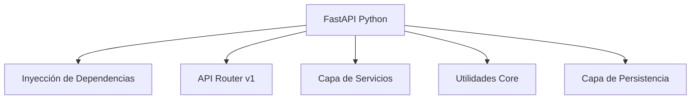
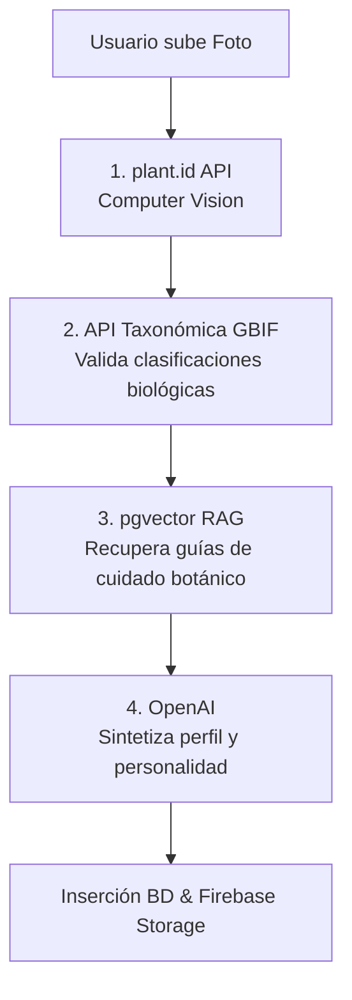
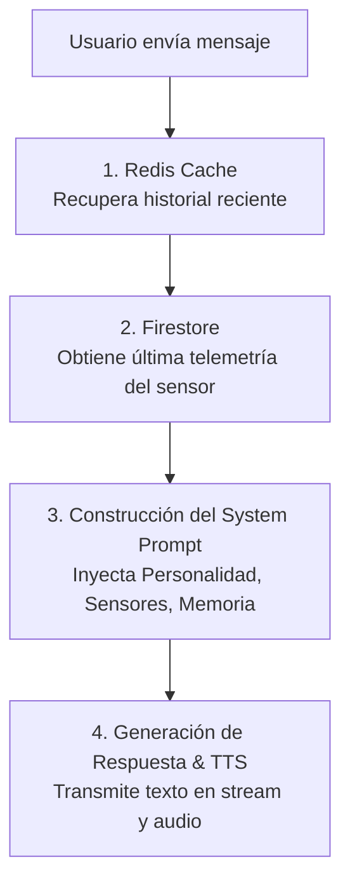

<div align="center">
  
  <h1>Gossip Garden Backend</h1>
  <p><em>El cerebro central del ecosistema Gossip Garden.</em></p>

  <p>
    <a href="README.md">Read in English</a>
  </p>

  
  
  
  
  
</div>

---

## Tabla de Contenidos

1. [Visión General del Ecosistema](#1-visión-general-del-ecosistema)
2. [Qué hace Gossip Garden Backend](#2-qué-hace-gossip-garden-backend)
3. [Arquitectura](#3-arquitectura)
4. [Flujo de Datos](#4-flujo-de-datos)
5. [Stack Tecnológico](#5-stack-tecnológico)
6. [Estructura del Proyecto](#6-estructura-del-proyecto)
7. [Módulos Principales](#7-módulos-principales)
8. [Referencia de la API](#8-referencia-de-la-api)
9. [Ejecutar el Backend](#9-ejecutar-el-backend)
10. [Variables de Entorno](#10-variables-de-entorno)
11. [Despliegue](#11-despliegue)

---

## 1. Visión General del Ecosistema

Gossip Garden es una plataforma de jardinería inteligente impulsada por IA compuesta por varios componentes interconectados:



| Producto | Rol |
|---|---|
| **frontendGossipGarden** | Cliente Flutter — chat IA, escáner de identificación, gráficos de sensores, notificaciones push |
| **backendGossipGarden** | Motor central — RAG, generación de personalidad IA, ingesta de sensores, evaluación de salud |
| **Sensor ESP32** | Componente de hardware — publica datos de humedad, temperatura y luz en tiempo real vía MQTT |
| **gossip-garden-presentation** | Plataforma de presentación Landing / Demo en Next.js |

### Cómo se conectan los productos

1. El usuario toma una foto de una planta desconocida en la app **Flutter**.
2. La imagen se envía al **backend FastAPI**, pasando por el pipeline de identificación (plant.id -> GBIF -> RAG -> OpenAI).
3. El **Sensor ESP32** publica mensajes MQTT en un broker; el backend se suscribe e ingiere la telemetría, almacenándola en Firebase y evaluando la salud.
4. El usuario chatea con la planta. El backend obtiene el contexto activo de los sensores, inyecta la personalidad de la especie y devuelve respuestas generadas por OpenAI.

---

## 2. Qué hace Gossip Garden Backend

| Característica | Descripción |
|---|---|
| **Pipeline de Identificación de Plantas** | Motor de inferencia de múltiples pasos que fusiona visión por computadora externa con bases de datos de taxonomía y búsquedas vectoriales RAG |
| **Chatbot Consciente del Contexto** | IA basada en personalidad que responde según las métricas de los sensores en tiempo real y los rasgos botánicos de la planta |
| **Ingesta de Telemetría** | Consumidor MQTT en segundo plano que mapea los datos crudos entrantes de los sensores a perfiles de plantas específicos |
| **Evaluador de Salud** | Bucle en segundo plano que calcula puntajes de salud ponderados (Saludable, Advertencia, Crítico) basándose en los datos de sensores frente a las tolerancias de la especie |
| **Generación de Audio (TTS)** | Convierte las respuestas del chat de IA en habla expresiva adaptada al perfil de voz de la planta |
| **Persistencia Políglota** | Enruta datos relacionales a Supabase (PostgreSQL), telemetría/logs a Firestore y las imágenes a Firebase Storage |

---

## 3. Arquitectura

### Servidor



---

## 4. Flujo de Datos

### El Pipeline de Identificación



### El Pipeline de Chat



---

## 5. Stack Tecnológico

### Framework Principal

| Capa | Tecnología |
|---|---|
| Framework | FastAPI |
| Entorno de Ejecución | Python 3.10+ |
| Servidor ASGI | Uvicorn |
| Validación | Pydantic v2 |

### Persistencia y Datos

| Capa | Tecnología |
|---|---|
| Base de Datos Principal | PostgreSQL (Supabase) |
| Motor Vectorial | pgvector (vía Supabase) |
| NoSQL / Telemetría | Firebase Firestore |
| Almacenamiento de Archivos | Firebase Storage |
| Caché y Memoria | Redis |

### IA e Integraciones

| Proveedor | Propósito |
|---|---|
| OpenAI | GPT-4 para Chat y síntesis RAG, TTS para voz |
| plant.id | Visión por computadora para identificación de especies |
| API GBIF | Validación taxonómica y datos de especies |
| MQTT (paho-mqtt) | Ingesta de telemetría de sensores en segundo plano |

---

## 6. Estructura del Proyecto

```text
backendGossipGarden/
│
├── app/
│   ├── api/
│   │   └── v1/
│   │       ├── api.py                 # Registro central de enrutadores
│   │       └── endpoints/             # Controladores HTTP
│   │           ├── auth.py            # Autenticación de usuarios
│   │           ├── chat.py            # Lógica conversacional IA y TTS
│   │           ├── devices.py         # Tokens de notificaciones push
│   │           ├── identification.py  # Procesamiento de imágenes y plant.id
│   │           ├── notifications.py   # Alertas de usuario
│   │           ├── plants.py          # CRUD de plantas e historiales de sensores
│   │           ├── sensors.py         # Respaldo REST para ingesta de sensores
│   │           └── users.py           # Perfiles de usuario
│   │
│   ├── core/
│   │   ├── config.py                  # Validación de variables de entorno
│   │   ├── security.py                # Verificación de JWT de Supabase
│   │   └── mqtt.py                    # Bucle del cliente MQTT en segundo plano
│   │
│   ├── db/                            # Inicializaciones de clientes Singleton
│   │   ├── firebase.py
│   │   ├── redis.py
│   │   └── supabase.py
│   │
│   ├── schemas/                       # Modelos de Pydantic v2
│   │
│   └── services/                      # Capa de Lógica de Negocio
│       ├── chat_service.py
│       ├── evaluator_service.py       # Bucle en segundo plano de puntaje de salud
│       ├── fcm_service.py
│       ├── gbif_service.py
│       ├── health_service.py
│       ├── identification_pipeline.py # Orquesta el flujo RAG
│       ├── image_storage_service.py
│       ├── notification_service.py
│       ├── openai_service.py
│       ├── plant_id_service.py
│       ├── rag_service.py
│       ├── species_repository.py
│       ├── summarizer_service.py
│       └── tts_service.py
│
├── main.py                            # Ciclo de vida FastAPI y punto de entrada
├── Dockerfile                         # Definición del contenedor
├── requirements.txt                   # Dependencias de Python
└── pytest.ini                         # Configuración de pruebas
```

---

## 7. Módulos Principales

### Pipeline de Identificación (`identification_pipeline.py`)

Un orquestador de múltiples etapas que abstrae la complejidad de introducir una nueva planta al sistema. Maneja cargas de imágenes multiparte, las comprime usando Pillow y coordina las llamadas secuenciales a `plant.id`, `GBIF` y la base de datos RAG `pgvector`. Si la confianza es baja, se detiene y devuelve candidatos para que el usuario los verifique manualmente.

### Motor de Chat y Personalidad (`chat_service.py`)

Define el "alma" de la planta. Construye un prompt de sistema dinámico en cada interacción. El motor lee los `personality_traits` de la planta (ej. dramática, alegre, sarcástica) e inyecta los estados actuales de los sensores (ej. "Tengo sed porque mi humedad es del 20 por ciento"). Utiliza Redis para el contexto conversacional rápido a corto plazo y Firestore para registros de chat permanentes y auditables.

### Bucle Evaluador de Salud (`evaluator_service.py`)

Una tarea continua en segundo plano (que se ejecuta durante el ciclo de vida de FastAPI) que consulta Firebase para obtener las últimas lecturas de sensores en todas las plantas activas. Compara las métricas actuales con los rangos óptimos definidos en el perfil RAG de la especie. Si una métrica queda fuera de los límites por un período prolongado, actualiza el registro de Supabase a `warning` o `critical` y activa una notificación push FCM.

### Ingesta de Telemetría (`core/mqtt.py`)

Evita la sobrecarga de la API REST tradicional para el hardware. Un cliente MQTT se suscribe a un broker al inicio. Cuando un sensor ESP32 publica una carga útil (temperatura, luz, humedad), el backend la analiza, la mapea a la planta correcta a través de una dirección MAC del hardware o una anulación de transmisión (broadcast mode), y la guarda en Firestore para su transmisión en tiempo real al frontend.

---

## 8. Referencia de la API

Todas las rutas requieren un JWT de Supabase válido en `Authorization: Bearer <token>` a menos que se especifique lo contrario.

### Auth

| Método | Ruta | Descripción |
|---|---|---|
| `POST` | `/api/v1/auth/register` | Registrar un nuevo usuario |
| `POST` | `/api/v1/auth/login` | Autenticar y recuperar JWT |
| `GET` | `/api/v1/auth/google-url` | URL de inicio de sesión OAuth2 de Google |
| `POST` | `/api/v1/auth/refresh` | Refrescar token de acceso |

### Plantas

| Método | Ruta | Descripción |
|---|---|---|
| `GET` | `/api/v1/plants/` | Listar las plantas del usuario |
| `POST` | `/api/v1/plants/` | Crear una nueva planta manualmente |
| `GET` | `/api/v1/plants/{id}/profile` | Obtener detalles completos de la planta |
| `PATCH` | `/api/v1/plants/{id}` | Actualizar metadatos de la planta |
| `DELETE` | `/api/v1/plants/{id}` | Eliminar la planta y los datos asociados |
| `GET` | `/api/v1/plants/{id}/sensor-data/latest` | Recuperar telemetría actual |
| `GET` | `/api/v1/plants/{id}/sensor-data/history` | Recuperar datos históricos de sensores |
| `POST` | `/api/v1/plants/{id}/actions` | Registrar una acción del usuario (ej. regado, fertilizado) |

### Identificación e IA

| Método | Ruta | Descripción |
|---|---|---|
| `POST` | `/api/v1/identification/identify` | Carga multiparte para inferencia de plantas |
| `POST` | `/api/v1/identification/species/from-candidate` | Completar creación desde un candidato seleccionado |
| `GET` | `/api/v1/identification/species/search` | Búsqueda de texto manual de especies |
| `POST` | `/api/v1/chat/{id}` | Enviar un mensaje a la IA de la planta |
| `GET` | `/api/v1/chat/{id}/history` | Recuperar la transcripción del chat |
| `POST` | `/api/v1/chat/transcribe` | Transcripción de audio Whisper |

### Dispositivos y Push

| Método | Ruta | Descripción |
|---|---|---|
| `POST` | `/api/v1/devices` | Registrar token push FCM |
| `DELETE` | `/api/v1/devices/{token}` | Anular el registro del token |
| `GET` | `/api/v1/notifications` | Obtener notificaciones de usuario no leídas |

---

## 9. Ejecutar el Backend

### Prerrequisitos

- Python 3.10+
- Una instancia de Redis en ejecución
- Credenciales del proyecto Supabase
- JSON de cuenta de servicio de Firebase

### Instalar

```bash
git clone <repo-url>
cd backendGossipGarden
python -m venv .venv
source .venv/bin/activate
pip install -r requirements.txt
```

### Iniciar Servidor

```bash
uvicorn app.main:app --reload --host 0.0.0.0 --port 8000
```

---

## 10. Variables de Entorno

Crear un archivo `.env` en el directorio raíz:

```env
SUPABASE_URL=https://xyz.supabase.co
SUPABASE_KEY=your_service_role_key
OPENAI_API_KEY=sk-...
PLANT_ID_API_KEY=...
REDIS_URL=redis://localhost:6379/0
FIREBASE_CREDENTIALS_PATH=./firebase_credentials.json

# Configuración MQTT
MQTT_BROKER=broker.hivemq.com
MQTT_PORT=1883
MQTT_TOPIC=gossipgarden/sensors/#
```

---

## 11. Despliegue

El backend está contenerizado y listo para ser desplegado en plataformas como Render, Railway o AWS ECS.

```bash
docker build -t gossip-garden-backend .
docker run -p 8000:8000 --env-file .env gossip-garden-backend
```
