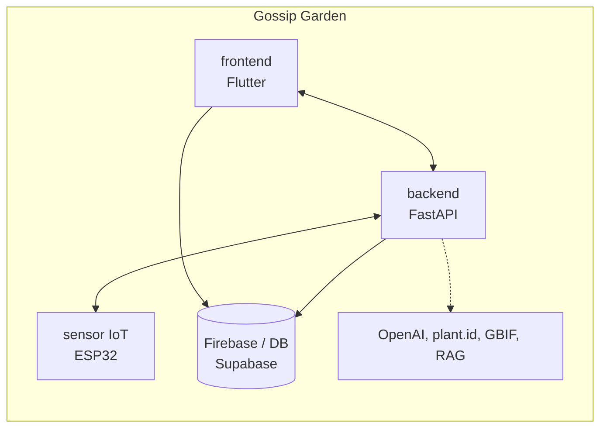
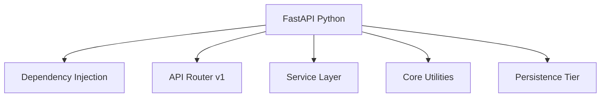
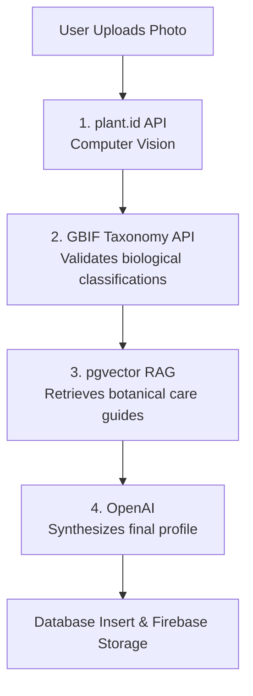
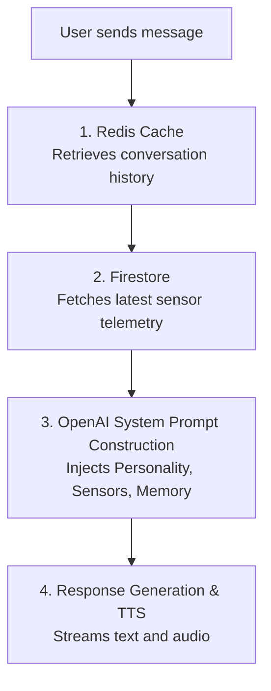

<div align="center">
  
  <h1>Gossip Garden Backend</h1>
  <p><em>The central intelligence of the Gossip Garden ecosystem.</em></p>

  <p>
    <a href="README.es.md">Leer en Español</a>
  </p>

  
  
  
  
  
</div>

---

## Table of Contents

1. [Ecosystem Overview](#1-ecosystem-overview)
2. [What Gossip Garden Backend Does](#2-what-gossip-garden-backend-does)
3. [Architecture](#3-architecture)
4. [Data Flow](#4-data-flow)
5. [Tech Stack](#5-tech-stack)
6. [Project Structure](#6-project-structure)
7. [Core Modules](#7-core-modules)
8. [API Reference](#8-api-reference)
9. [Running the Backend](#9-running-the-backend)
10. [Environment Variables](#10-environment-variables)
11. [Deployment](#11-deployment)

---

## 1. Ecosystem Overview

Gossip Garden is an AI-powered smart gardening platform composed of several interconnected components:



| Product | Role |
|---|---|
| **frontendGossipGarden** | Flutter client — AI chat, identification scanner, sensor graphs, push notifications |
| **backendGossipGarden** | Core engine — RAG, AI personality generation, sensor ingestion, health evaluation |
| **ESP32 Sensor** | Hardware component — pushes real-time moisture, temperature, and light data via MQTT |
| **gossip-garden-presentation** | Next.js Landing / Demo presentation platform |

### How the products connect

1. The user captures a photo of an unknown plant in the **Flutter** app.
2. The image is sent to the **FastAPI backend**, passing through the identification pipeline (plant.id -> GBIF -> RAG -> OpenAI).
3. The **ESP32 Sensor** publishes MQTT messages to a broker; the backend subscribes and ingests telemetry, storing it in Firebase and evaluating health.
4. The user chats with the plant. The backend fetches active sensor context, injects the species personality, and returns OpenAI-generated responses.

---

## 2. What Gossip Garden Backend Does

| Feature | Description |
|---|---|
| **Plant Identification Pipeline** | Multi-step inference engine merging external computer vision with taxonomy databases and RAG vector searches |
| **Context-Aware Chatbot** | Personality-driven AI that responds based on the plant's current real-time sensor metrics and botanical traits |
| **Telemetry Ingestion** | Background MQTT consumer that maps incoming raw sensor data to specific plant profiles |
| **Health Evaluator** | Background loop calculating weighted health scores (Healthy, Warning, Critical) based on sensor data vs species tolerances |
| **Audio Generation (TTS)** | Converts AI chat responses into expressive speech tailored to the plant's voice profile |
| **Polyglot Persistence** | Routes relational data to Supabase (PostgreSQL), telemetry/logs to Firestore, and images to Firebase Storage |

---

## 3. Architecture

### Server



---

## 4. Data Flow

### The Identification Pipeline



### The Chat Pipeline



---

## 5. Tech Stack

### Core Framework

| Layer | Technology |
|---|---|
| Framework | FastAPI |
| Runtime | Python 3.10+ |
| ASGI Server | Uvicorn |
| Validation | Pydantic v2 |

### Persistence & Data

| Layer | Technology |
|---|---|
| Primary Database | PostgreSQL (Supabase) |
| Vector Engine | pgvector (via Supabase) |
| NoSQL / Telemetry | Firebase Firestore |
| File Storage | Firebase Storage |
| Caching & Memory | Redis |

### AI & Integrations

| Provider | Purpose |
|---|---|
| OpenAI | GPT-4 for Chat and RAG synthesis, TTS for voice |
| plant.id | Computer vision for species identification |
| GBIF API | Taxonomic validation and species data |
| MQTT (paho-mqtt) | Background sensor telemetry ingestion |

---

## 6. Project Structure

```text
backendGossipGarden/
│
├── app/
│   ├── api/
│   │   └── v1/
│   │       ├── api.py                 # Central router registration
│   │       └── endpoints/             # HTTP Controllers
│   │           ├── auth.py            # User authentication
│   │           ├── chat.py            # AI conversational logic & TTS
│   │           ├── devices.py         # Push notification tokens
│   │           ├── identification.py  # Image processing & plant.id
│   │           ├── notifications.py   # User alerts
│   │           ├── plants.py          # Plant CRUD and sensor histories
│   │           ├── sensors.py         # REST fallback for sensor ingestion
│   │           └── users.py           # User profiles
│   │
│   ├── core/
│   │   ├── config.py                  # Environment variable validation
│   │   ├── security.py                # Supabase JWT verification
│   │   └── mqtt.py                    # Background MQTT client loop
│   │
│   ├── db/                            # Singleton client initializations
│   │   ├── firebase.py
│   │   ├── redis.py
│   │   └── supabase.py
│   │
│   ├── schemas/                       # Pydantic v2 models
│   │
│   └── services/                      # Business Logic Layer
│       ├── chat_service.py
│       ├── evaluator_service.py       # Health scoring background loop
│       ├── fcm_service.py
│       ├── gbif_service.py
│       ├── health_service.py
│       ├── identification_pipeline.py # Orchestrates RAG flow
│       ├── image_storage_service.py
│       ├── notification_service.py
│       ├── openai_service.py
│       ├── plant_id_service.py
│       ├── rag_service.py
│       ├── species_repository.py
│       ├── summarizer_service.py
│       └── tts_service.py
│
├── main.py                            # FastAPI lifespan and entry point
├── Dockerfile                         # Container definition
├── requirements.txt                   # Python dependencies
└── pytest.ini                         # Testing configuration
```

---

## 7. Core Modules

### Identification Pipeline (`identification_pipeline.py`)

A multi-stage orchestrator that abstracts the complexity of bringing a new plant into the system. It handles multipart image uploads, compresses them using Pillow, and coordinates the sequential calls to `plant.id`, `GBIF`, and the `pgvector` RAG database. If confidence is low, it halts and returns candidates for the user to manually verify.

### Chat & Personality Engine (`chat_service.py`)

Defines the "soul" of the plant. It constructs a dynamic system prompt on every interaction. The engine reads the plant's `personality_traits` (e.g., dramatic, cheerful, sarcastic) and injects the current sensor states (e.g., "I am thirsty because my moisture is 20 percent"). It uses Redis for fast, short-term conversational context and Firestore for permanent, auditable chat logs.

### Health Evaluator Loop (`evaluator_service.py`)

A continuous background task (running during the FastAPI lifespan) that polls Firebase for the latest sensor readings across all active plants. It compares current metrics against the optimal ranges defined in the species' RAG profile. If a metric falls out of bounds for a sustained period, it updates the Supabase record to `warning` or `critical` and triggers an FCM push notification.

### Telemetry Ingestion (`core/mqtt.py`)

Bypasses the traditional REST API overhead for hardware. An MQTT client subscribes to a broker on startup. When an ESP32 sensor publishes a payload (temperature, light, moisture), the backend parses it, maps it to the correct plant via a hardware MAC address or broadcast override, and commits it to Firestore for real-time streaming to the frontend.

---

## 8. API Reference

All routes require a valid Supabase JWT `Authorization: Bearer <token>` unless specified otherwise.

### Auth

| Method | Route | Description |
|---|---|---|
| `POST` | `/api/v1/auth/register` | Register a new user |
| `POST` | `/api/v1/auth/login` | Authenticate and retrieve JWT |
| `GET` | `/api/v1/auth/google-url` | OAuth2 Google login URL |
| `POST` | `/api/v1/auth/refresh` | Refresh access token |

### Plants

| Method | Route | Description |
|---|---|---|
| `GET` | `/api/v1/plants/` | List user's plants |
| `POST` | `/api/v1/plants/` | Create a new plant manually |
| `GET` | `/api/v1/plants/{id}/profile` | Get full plant details |
| `PATCH` | `/api/v1/plants/{id}` | Update plant metadata |
| `DELETE` | `/api/v1/plants/{id}` | Delete plant and associated data |
| `GET` | `/api/v1/plants/{id}/sensor-data/latest` | Retrieve current telemetry |
| `GET` | `/api/v1/plants/{id}/sensor-data/history` | Retrieve historical sensor data |
| `POST` | `/api/v1/plants/{id}/actions` | Log a user action (e.g., watered, fertilized) |

### Identification & AI

| Method | Route | Description |
|---|---|---|
| `POST` | `/api/v1/identification/identify` | Multipart upload for plant inference |
| `POST` | `/api/v1/identification/species/from-candidate` | Complete creation from a user-selected candidate |
| `GET` | `/api/v1/identification/species/search` | Manual species text search |
| `POST` | `/api/v1/chat/{id}` | Send a message to the plant AI |
| `GET` | `/api/v1/chat/{id}/history` | Retrieve chat transcript |
| `POST` | `/api/v1/chat/transcribe` | Whisper audio transcription |

### Devices & Push

| Method | Route | Description |
|---|---|---|
| `POST` | `/api/v1/devices` | Register FCM push token |
| `DELETE` | `/api/v1/devices/{token}` | Unregister token |
| `GET` | `/api/v1/notifications` | Fetch unread user notifications |

---

## 9. Running the Backend

### Prerequisites

- Python 3.10+
- A running Redis instance
- Supabase project credentials
- Firebase Service Account JSON

### Install

```bash
git clone <repo-url>
cd backendGossipGarden
python -m venv .venv
source .venv/bin/activate
pip install -r requirements.txt
```

### Start Server

```bash
uvicorn app.main:app --reload --host 0.0.0.0 --port 8000
```

---

## 10. Environment Variables

Create a `.env` file in the root directory:

```env
SUPABASE_URL=https://xyz.supabase.co
SUPABASE_KEY=your_service_role_key
OPENAI_API_KEY=sk-...
PLANT_ID_API_KEY=...
REDIS_URL=redis://localhost:6379/0
FIREBASE_CREDENTIALS_PATH=./firebase_credentials.json

# MQTT Configuration
MQTT_BROKER=broker.hivemq.com
MQTT_PORT=1883
MQTT_TOPIC=gossipgarden/sensors/#
```

---

## 11. Deployment

The backend is containerized and ready for deployment on platforms like Render, Railway, or AWS ECS.

```bash
docker build -t gossip-garden-backend .
docker run -p 8000:8000 --env-file .env gossip-garden-backend
```
